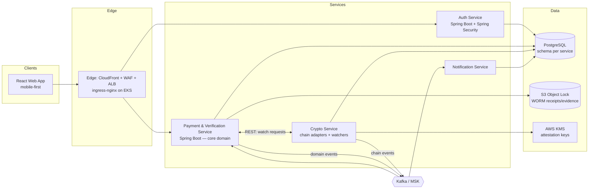
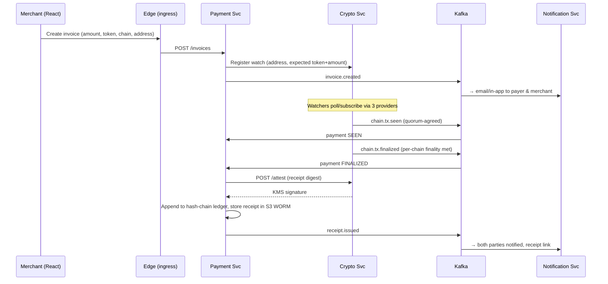

# Themistra — Phase 1 System Architecture

**Status:** Approved baseline · **Date:** 2026-07-11
**Scope:** Phase 1 (Blockchain Payment Verification) with explicit extension points for Phases 2–5.

---

## 1. Design Principles

1. **Non-custodial by design.** Themistra never holds user funds and never manages user private keys. The only cryptographic keys we own are platform attestation keys. This is our biggest security advantage — protect it.
2. **The product is the attestation.** The core threat is not "attacker steals funds" (there are none) but **"attacker makes Themistra attest to something false"** or **"someone credibly claims our records were altered."** Every architectural decision below is weighed against those two failures.
3. **Deliberately over-built where it can't be retrofitted.** We are not building a throwaway MVP. Multi-provider verification, KMS-based signing, and tamper-evident records are day-one investments because they are nearly impossible to add credibly later.
4. **Lean where it can be retrofitted.** Chain count, notification channels, and feature breadth start small. Launch with 2 chains done rigorously, not 6 done shallowly.
5. **Boundaries drawn for Phase 2+.** The intelligence engine, dispute resolution, and reputation systems arrive as *new consumers of existing events*, not rewrites.

---

## 2. High-Level Topology

Four backend services (the agreed minimum layout) plus the **Payment & Verification Service**, which owns the actual product domain, and a **lean edge layer** (ingress-nginx behind ALB/WAF — configuration, not a service) so the frontend talks to one origin.

---

## 3. Services

### 3.1 Edge / API Gateway — lean start

- **Decision (2026-07-11):** start lean. No gateway *service*; the edge is configuration: **CloudFront → WAF → ALB → ingress-nginx (EKS) → services.**
- **ingress-nginx duties:** path-based routing to services, per-route rate limits, request size limits, header sanitization — all via standard annotations, battle-tested, zero code to own.
- **JWT validation lives in each service** (Spring Security OAuth2 resource server against the Auth Service's JWKS endpoint). This is required regardless of gateway choice — zero trust: no service assumes the edge authenticated the caller. Edge-level JWT rejection is a later optimization, not a security boundary.
- **Graduation triggers** for a dedicated gateway (Spring Cloud Gateway or AWS API Gateway): merchant API-key management, the Phase 5 partner-facing API plane, or real BFF response-aggregation needs. Until one arrives, a gateway service is ceremony. The migration is clean because no domain logic ever lives at the edge.

### 3.2 Auth Service (Java Spring Boot)

- **Role:** Registration, login, MFA, session/token issuance, user profile, API keys for merchant integrations.
- **Tech:** Spring Boot + Spring Security + Spring Authorization Server (OAuth2/OIDC issuer). Tokens are short-lived JWTs + rotating refresh tokens.
- **Data owned:** `auth` schema — users, credentials, MFA enrollment, API keys (hashed), sessions.
- **Notes:**
  - MFA (TOTP) from day one for any account that can create invoices — account takeover on a trust platform is reputational damage.
  - Publishes `user.registered`, `user.suspended` events to Kafka.
  - Web2 security posture (Spring Security, OWASP ASVS practices) is considered sufficient here, per team decision.

### 3.3 Payment & Verification Service (Java Spring Boot) — **core domain**

- **Role:** Owns everything Phase 1 actually sells:
  - Invoice creation and lifecycle
  - Payment records and the verification state machine
  - Tamper-proof receipt issuance
  - Tax-ready transaction history and exports
- **Verification state machine (per payment):**

  `CREATED → WATCHING → SEEN → CONFIRMING → FINALIZED → ATTESTED`
  with explicit reversal transitions: `CONFIRMING → SEEN` and `SEEN → WATCHING` on chain reorg. **A receipt is only issued from `FINALIZED`, never earlier.**
- **Data owned:** `payments` schema — invoices, payments, verification records, receipt metadata, hash-chain ledger (§6.5).
- **Consumes:** `chain.tx.seen`, `chain.tx.confirmed`, `chain.tx.finalized`, `chain.tx.reorged` (from Crypto Service).
- **Publishes:** `invoice.created`, `payment.seen`, `payment.finalized`, `receipt.issued`.
- **Calls:** Crypto Service via REST to register/unregister watches; KMS-backed signing is requested through the Crypto Service attestation endpoint (§6.4).

### 3.4 Crypto Service (chain adapters + watchers)

- **Role:** The only component that talks to blockchains. Two internal halves:
  1. **Adapter layer** — one adapter per chain (launch: **Tron + Ethereum**; next: Base, BSC, Solana) behind a common interface: `getTx`, `getTokenInfo`, `subscribeAddress`, `getFinalityStatus`.
  2. **Watcher layer** — long-running processes holding websocket subscriptions / polling loops per watched address or tx hash. This service is a *daemon with an API*, not a request handler.
- **Tech:** Spring Boot + web3j for EVM chains; Tron via TronGrid/java-tron gRPC. If a chain's Java tooling is weak (e.g., Solana later), a thin sidecar in TypeScript is acceptable — the Kafka contract is the boundary, not the language.
- **Quorum read layer (§6.1) lives here.** No single-provider answer ever leaves this service as fact.
- **Data owned:** `chain` schema — watch registrations, provider health, per-chain cursor/checkpoint state, raw observation log (what each provider said, kept for audit).
- **Publishes:** `chain.tx.seen`, `chain.tx.confirmed` (with confirmation count), `chain.tx.finalized`, `chain.tx.reorged`, `chain.provider.degraded`.
- **Idempotency:** every emitted event carries a deterministic key (`chain:txhash:eventtype`); consumers must dedupe. The same tx **will** be observed multiple times.

### 3.5 Notification Service

- **Role:** Fan-out of user-facing updates. Consumes domain events, resolves user channel preferences, delivers.
- **Channels (launch):** email + in-app (websocket/SSE routed through the edge/ingress). **Next:** merchant webhooks (HMAC-signed payloads), then mobile push.
- **Data owned:** `notifications` schema — templates, preferences, delivery log (needed for "did the merchant get notified?" disputes later).
- **Consumes:** `invoice.created`, `payment.seen`, `payment.finalized`, `receipt.issued`, `user.registered`.
- **Idempotent by event key** — duplicate Kafka delivery must not double-email a user.

---

## 4. Communication

| Path | Mechanism | Why |
|---|---|---|
| Frontend → backend | REST via edge (ingress-nginx) | Request/response flows (create invoice, fetch history) |
| Payment ↔ Crypto | REST (watch registration) + Kafka (observations back) | Registration is synchronous intent; observations are inherently async |
| All domain events | Kafka (AWS MSK) | Fan-out, replay, and the Phase 2+ consumers plug in here |
| Service → own DB | Direct | Schema-per-service, no cross-schema queries — ever |

**Rules:**

1. **Outbox pattern everywhere.** A service writes its DB row and its outgoing event in one transaction (outbox table), a relay publishes to Kafka. No dual-write bugs; this is non-negotiable for a platform whose product is a consistent record.
2. **Kafka topics are versioned contracts.** Avro/JSON-Schema in a schema registry, backward-compatible evolution only. Topic naming: `<domain>.<entity>.<event>` (e.g., `payments.receipt.issued`).
3. **Consumers are idempotent.** Kafka is at-least-once; every consumer dedupes on event key.
4. **No synchronous chains longer than 2 hops.** If a flow needs three services synchronously, the domain boundaries are wrong — fix the boundary, don't add the call.

---

## 5. Data Layer

- **PostgreSQL (RDS Multi-AZ):** one logical schema per service (`auth`, `payments`, `chain`, `notifications`). Physically one cluster to start; the schema discipline makes later physical separation a migration, not a rewrite.
- **S3 with Object Lock (compliance mode):** issued receipts (PDF/JSON), raw provider observation snapshots, and later Phase 2 evidence uploads. WORM: written once, provably never altered.
- **Redis (ElastiCache):** session/token cache, rate-limit counters, watcher hot state.
- **Retention:** raw chain observations ≥ 7 years (tax-ready history is a headline feature; align with the strictest target-market requirement).

---

## 6. Security Architecture (Web3)

Web2 is covered by Spring Security + gateway/WAF; AWS account hardening (IAM least-privilege, VPC isolation, GuardDuty, CloudTrail) is handled at the infra level. This section covers the part with no off-the-shelf framework: **making false attestation practically impossible.**

### 6.1 Multi-provider quorum reads

- Every fact used in a verification (tx existence, amount, token contract, confirmations) is fetched from **N independent RPC providers** (launch: 3 — e.g., Alchemy + QuickNode + self-hosted node per top chain) and compared.
- **2-of-3 agreement** required to treat a fact as true. Disagreement → verification is `HELD`, ops alerted, never auto-resolved in the user's favor.
- Provider responses are logged verbatim to the observation log (S3 + `chain` schema) so any past attestation can be re-derived and defended.
- Self-hosted nodes for Tron and Ethereum are on the roadmap for month 1–3; until then, three *commercially independent* providers.

### 6.2 Per-chain finality policy (reorg safety)

Confirmation thresholds are **per-chain policy objects**, not a global constant:

| Chain | Finality rule |
|---|---|
| Ethereum | Beacon-chain `finalized` checkpoint (not block count) |
| Tron | Solidified block (~19 confirmations) |
| Base / Arbitrum (later) | L2 confirmed **and** batch settled on L1 for attestation |
| Solana (later) | `finalized` commitment level |

Reorgs are a first-class state transition (`chain.tx.reorged`), and the payment state machine walks backward accordingly. **Attestation only ever happens at finality.**

### 6.3 Token & address validation

- **Tokens are identified by contract address, never by symbol.** A signed, versioned canonical-token allowlist per chain (USDT/USDC/etc. official contracts) lives in the Crypto Service. Anything else = `UNKNOWN_TOKEN`, surfaced loudly.
- EIP-55 checksum validation on all EVM addresses; Base58 checks on Tron.
- **Address-poisoning defense:** when a payer address closely resembles (matching prefix/suffix) a previously seen counterparty but differs, flag it in the verification record and the user-facing result.

### 6.4 Attestation key custody (AWS KMS → Nitro Enclaves)

- Receipt-signing keys are **generated inside AWS KMS and never leave it.** The Crypto Service exposes an internal `POST /attest` endpoint that sends the receipt digest to KMS for signing; no service ever holds key material.
- Key rotation: annual scheduled + immediate on suspicion; receipts embed the key ID; **verification public keys are published** at a well-known URL so third parties can independently verify any Themistra receipt.
- **Stretch (quarter 2–3): Nitro Enclaves.** Move the "verify quorum + finality, then sign" logic into an enclave, and scope the KMS key policy to that enclave's attested image measurement. Result: even a fully compromised host cannot sign a receipt that didn't pass verification. This is a marketable security claim.

### 6.5 Tamper-evident records (hash chain)

- The Payment Service maintains an append-only ledger: each verification/receipt record includes the SHA-256 of the previous record (`prev_hash`), forming a hash chain.
- The chain head is **anchored on-chain daily** (a cheap tx embedding the head hash) and the anchor tx recorded.
- Combined with S3 Object Lock, this gives a cryptographic answer to "how do we know Themistra didn't alter this record?" — which becomes a core product claim in Phases 2–3.

### 6.6 Compliance screening

- Before attesting, counterparty addresses are screened via a wallet-risk API (**Chainalysis / TRM Labs / Elliptic** — pick on pricing).
- Sanctioned/OFAC hit → verification `BLOCKED`, compliance queue, no receipt.
- Screening results are stored per verification (audit trail) and become training signal for the Phase 5 fraud engine.

### 6.7 Threat model as a living document

`SECURITY-THREAT-MODEL.md` (to be written before the first line of crypto-service code) enumerates at minimum:

1. Attacker controls one RPC provider → §6.1
2. Attacker deploys fake USDT contract → §6.3
3. Chain reorg after user sees "confirmed" → §6.2
4. Stolen application server credentials → §6.4 (keys unexfiltratable)
5. Insider alters a historical verification → §6.5
6. Address-poisoning of a repeat customer → §6.3
7. Merchant webhook spoofing → HMAC-signed webhooks (§3.5)
8. Account takeover of a merchant → MFA (§3.2)

Every new feature PRs an update to this document or states why none is needed.

---

## 7. Core Flow — Verified Payment, End to End

---

## 8. AWS Infrastructure

| Concern | Choice |
|---|---|
| Compute | **EKS** (we're building for scale deliberately; ECS Fargate acceptable if the team prefers less K8s ops) |
| Kafka | **AWS MSK** (managed; serverless tier to start) |
| Database | **RDS PostgreSQL Multi-AZ**, encrypted, automated backups + PITR |
| Object storage | **S3 + Object Lock** for receipts/observations |
| Keys/secrets | **KMS** (attestation + envelope encryption), **Secrets Manager** (DB creds, provider API keys, auto-rotation) |
| Cache | ElastiCache Redis |
| Edge | ALB + **WAF** + CloudFront for the React app |
| Network | Private subnets for all services; only ALB public; VPC endpoints for S3/KMS/Secrets; egress to RPC providers through a NAT with allowlisted destinations |
| IAM | One role per service, least privilege; **only the Crypto Service role can call `kms:Sign` on the attestation key** |
| Audit/detection | CloudTrail (org-level, immutable), GuardDuty, Security Hub; alarms on any KMS attestation-key usage outside the Crypto Service role |
| Observability | OpenTelemetry from all services → CloudWatch/Grafana; per-chain watcher lag and provider-disagreement rate are **paged** metrics |
| IaC | AWS CDK (TypeScript) from day one; no console-created resources. Chosen over Terraform: we're AWS-domiciled so portability buys nothing, and CDK keeps the two-language rule intact while giving type-checked, reusable constructs (e.g., one `ThemistraService` construct stamping out identical least-privilege service scaffolding) |
| Environments | `dev` / `staging` / `prod` as separate AWS accounts (AWS Organizations) — cheap now, painful later |

---

## 9. Phase 2+ Extension Points (already provisioned)

| Future need | Where it plugs in |
|---|---|
| AI evidence interpretation (Phase 2) | New **Intelligence Service** consuming existing Kafka topics + S3 evidence bucket; zero changes to Phase 1 services |
| Evidence integrity analysis | Uploads already land in S3 WORM with metadata; integrity pipeline is a new consumer |
| Auto evidence collection from tx hash | Already exists: Crypto Service `getTx` + observation log |
| Dispute resolution (Phase 3) | Dispute Service reads the hash-chain ledger + observation log — the defensible record is already being built |
| Wallet reputation (Phase 4) | Event history in Kafka (long retention / tiered storage) + screening results = the raw feature set |
| Institutional APIs (Phase 5) | Edge graduates to a dedicated gateway with a partner-facing API plane (§3.1 triggers); receipts already independently verifiable via published keys |

---

## 10. Build Order

1. **Foundations (weeks 1–3):** AWS CDK baseline (accounts, VPC, EKS/ECS, RDS, MSK, KMS), CI/CD, schema registry, service skeletons, outbox library shared across services.
2. **Auth + edge (weeks 2–5):** OIDC issuer, MFA, ingress-nginx routing/rate limits, resource-server JWT validation in every service skeleton, React auth flows.
3. **Crypto Service — Tron + Ethereum (weeks 3–8):** adapters, quorum layer, watchers, finality policies, reorg handling, observation log. *The hard, differentiating engineering — staff it accordingly.*
4. **Payment Service (weeks 5–9):** invoices, state machine, hash-chain ledger, KMS attestation, receipts to S3, tax export.
5. **Notification Service (weeks 7–10):** email + in-app, delivery log.
6. **Hardening pass (weeks 9–12):** threat-model review, pen test, chaos test on provider disagreement + reorg simulation, publish verification public keys.
7. **Then widen:** merchant webhooks, next chains (Base, BSC), Nitro Enclaves.

---

*This document is the baseline. Material changes go through a short ADR (architecture decision record) in `docs/adr/` so Phase 2+ contributors can see why things are the way they are.*
